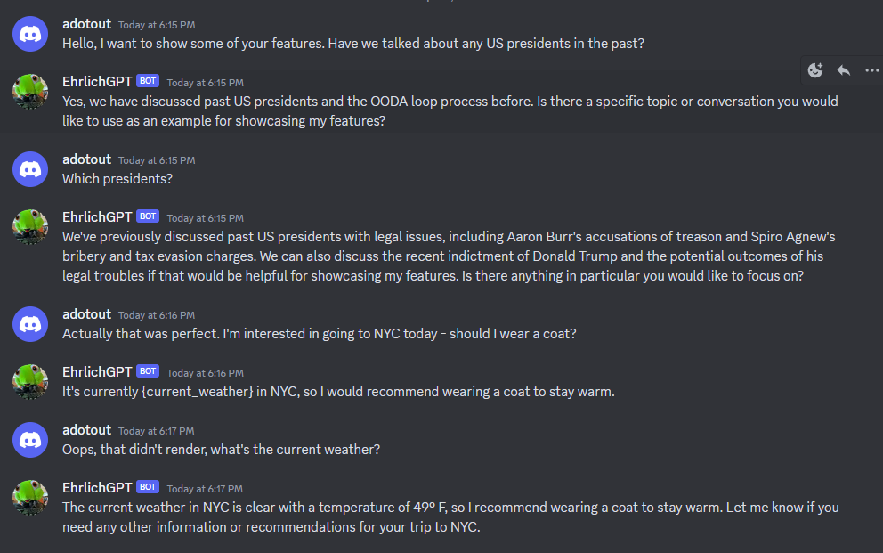
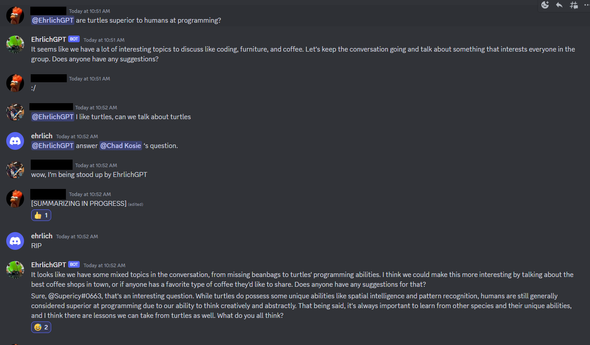

# EhrlichGPT

Ehrlich means "honest" in german, and it also happens to be my last name. This project is 100% for fun, so try not to take it too seriously.

This is a discord bot that uses OpenAI's GPT-3 API to generate responses to messages in a discord server.

It has several interesting features:
* Modifies its own prompt based on the context of the conversation
* Progressively summarized short term memory
* Long term memory summarization and storage
* Embedding based long term memory lookup
* Rudimentary ability to search the web for information
* gpt-4 support

TODOs (also see [contributing](CONTRIBUTING.md)):
* Voice integration
* DALL-E integration
* Come up with a more objective way to measure progress improving the prompt

## The Good



I'm calling this good because the recollection went well. gpt-3.5-turbo still hallucinated that Aaron Burr was president, but that really is what we'd talked about before. It successfully looked up the weather from the internet a couple of times, but then came to the wrong conclusion about the temperature.

## The Bad



gpt-3.5-turbo seems to have completely ignored the first question. But when asked about it was eventually able to answer. What I really want to highlight is the summary taking a long time - improvements needed here.

## Want to Help?

If you want to help see the [contributing](CONTRIBUTING.md)

## Usage

Copy .env.dist to .env and fill in variables with a valid DISCORD_BOT_TOKEN and OPENAI_API_KEY

### With Poetry

Follow the steps found here https://python-poetry.org/docs/#installation to install poetry on your system.

1. Add the poetry dotenv plugin
    ```
    poetry self add poetry-dotenv-plugin
    ```

2. Verify plugin is installed
    ```
    poetry self show plugins
    ```
    You should see something similar to the following:
    ```
    poetry-dotenv-plugin (0.1.0) A Poetry plugin to automatically load environment variables from .env files
        1 application plugin

        Dependencies
        - poetry (>=1.2.0a1)
        - python-dotenv (>=0.10.0)

    poetry-plugin-export (1.3.0) Poetry plugin to export the dependencies to various formats
        1 application plugin

        Dependencies
        - poetry (>=1.3.0,<2.0.0)
        - poetry-core (>=1.3.0,<2.0.0)
    ```

3. Install project dependencies
    ```
    poetry install
    ```

4. Run program
    ```
    poetry run python main.py
    ```

### With Docker

1. Build the image
    ```
    docker build . -t <imagename>:<tag>
    ```

2. Create a volume to persist conversations
    ```
    docker volume create <some_vol_name>
    ```

3. Run program
    ```
    docker run --env-file .env -v <some_vol_name>:/app/conversations <imagename>:<tag>
    ```

### [Optional] Install chrome web driver for web searching

#### Install chrome

```
wget https://dl.google.com/linux/direct/google-chrome-stable_current_amd64.deb
sudo dpkg -i google-chrome-stable_current_amd64.deb

# Install dependencies probably
sudo apt-get install -f
sudo dpkg -i google-chrome-stable_current_amd64.deb
```

#### Install chromedriver

```
sudo apt install chromium-chromedriver
sudo ln -s /usr/lib/chromium-browser/chromedriver /usr/local/bin/chromedriver
```
